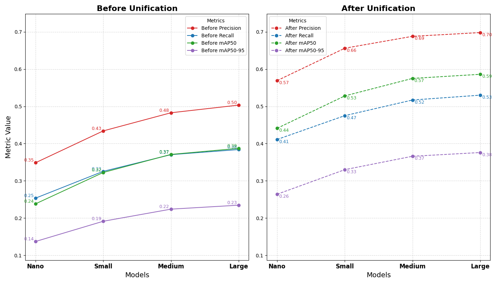

# YOLOv8 Model Training for Multi-Environment Vehicle Detection

---

## 📸 Project Gallery

  
  

  
  

  
  

---

## 📝 Overview
This project trains **YOLOv8 object detection models** on **four distinct datasets** and a **custom unified dataset** to maximize model diversity and ensure robustness across different environments.  

The goal is to build a **generalized detection model** capable of high performance in multiple real-world conditions.

---

## 📂 Dataset Composition
The unified dataset combines **four different aerial vehicle detection datasets**, ensuring variety in environments, object sizes, and perspectives.

  
*Figure 0 – Data composition from 4 sources.*

---

## ⚙️ Methodology

### Dataset Unification
- Labels reduced to **4 consistent classes** across datasets.  
- Some datasets reduced from 10 → 4 classes.  
- Others reduced from 8 → 4 classes.  
- Both **original-label** and **unified-label** models were trained for comparison.

  
*Figure 2 – Model comparison before and after unification.*

---

### Model Training
- **YOLOv8** used for all experiments.  
- Training performed on:
  - 4 individual datasets  
  - Unified dataset  
  - Final custom dataset (for maximum diversity)  
- Extensive benchmarking for robustness evaluation.

  
*Figure 1 – Model applied to a single image (YOLOv8 object detection).*

---

### Special Experiments
- **YOLOv8 vs YOLOv8-OBB** tested on a sample dataset.  
- Cross-dataset benchmarking to measure generalization.

  
*Figure 3 – YOLOv8 vs YOLOv8-OBB on a sample image.*

  
*Figure 4 – Benchmark results of models tested outside their own datasets.*

---

### Model Interpretability
To understand decision-making, **Eigen-CAM heatmaps** were generated for detection outputs.

  
*Figure 5 – Eigen-CAM heatmap visualization.*

---

## 🛠 Utilities
- **GPU memory clearing script** to avoid CUDA memory errors during training.

---

## 📊 Results Summary
- Precision, Recall, and mAP compared between:
  - Original-label models
  - Unified-label models
  - Final custom dataset model  
- Detailed metrics available in training notebooks.

---

## 📁 Repository Structure

| Path         | Description |
|--------------|-------------|
| `notebooks/` | Jupyter notebooks for training & benchmarking |
| `utils/`     | GPU clearing and helper scripts |
| `datasets/`  | Dataset preparation scripts or samples |
| `assests/`    | Figures and visual results |
| `README.md`  | Project documentation |
| `.gitignore` | Ignored files configuration |

---

## 📄 Full Report
Full documentation and experiments submitted to **MU** 🙂
